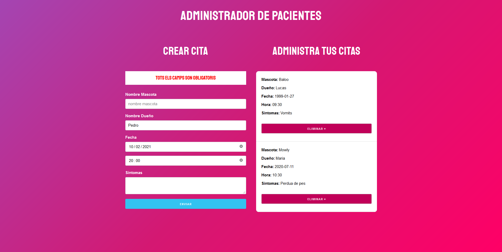

## Proyecto
Mi primer proyecto en React con formularios y el uso de localStorage.

Esta comentado.

Este proyecto forma parte del curso
https://www.udemy.com/course/react-de-principiante-a-experto-creando-mas-de-10-aplicaciones/

Tras descargar una copia del proyecto es necesario instalar los paquetes de los que depende.
Es necesario tener npm instalado en el destino.

### `npm install`

Tras la instalación.
### `npm start`

Runs the app in the development mode.\
Open [http://localhost:3000](http://localhost:3000) to view it in the browser.
